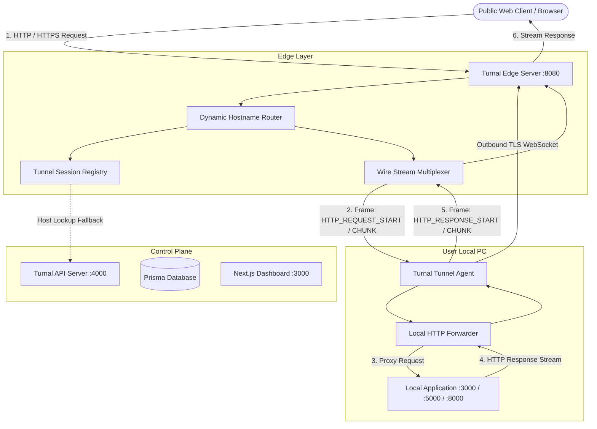

# 🏛 Turnal System Architecture

## Architectural Overview

Turnal is a distributed, modular tunneling platform designed to route public internet traffic directly to local network services through a persistent outbound connection.

---

## Core Components

### 1. Ingress & Edge Layer (`apps/edge`)
- **Port**: 8080 (Public HTTP/HTTPS entrypoint)
- **Role**:
  - Listens for incoming public web traffic.
  - Extracts the `Host` header (e.g. `myapp.turnal.live` or custom domain `app.example.com`).
  - Matches the hostname against active in-memory `TunnelSession` instances in the `TunnelRegistry`.
  - Encapsulates requests into protocol frames (`HTTP_REQUEST_START`, `HTTP_REQUEST_CHUNK`, `HTTP_REQUEST_END`) and routes them through the WebSocket connection to the specific connected agent.
  - Handles streaming response chunks back to the client.
  - Returns customized branded error pages if the tunnel agent is disconnected (`Tunnel Offline`) or unregistered (`Tunnel Not Found`).

### 2. Control Plane API (`apps/api`)
- **Port**: 4000
- **Role**:
  - User authentication (Registration, Login, JWT access/refresh tokens).
  - Tunnel lifecycle and subdomain reservation.
  - Domain verification via DNS TXT records.
  - API Key creation, hashing (SHA-256), and verification.
  - Real-time telemetry ingestion and analytics reporting.

### 3. Tunnel Agents (`apps/tunnel-agent`)
- **Implementations**:
  - **Go Native CLI** (`apps/tunnel-agent/go`)
  - **TypeScript CLI** (`apps/tunnel-agent/ts`)
- **Role**:
  - Runs locally on the developer's PC.
  - Establishes a persistent outbound WebSocket connection to `ws://edge:8080/tunnel/connect`.
  - Receives multiplexed request frames, opens a stream to `http://localhost:<port>`, and streams response frames back.
  - Performs automatic reconnection with exponential backoff and sends heartbeats every 15 seconds.
