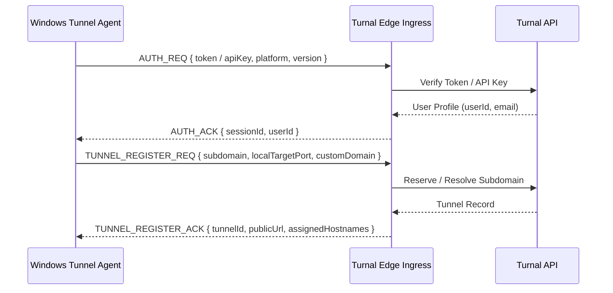
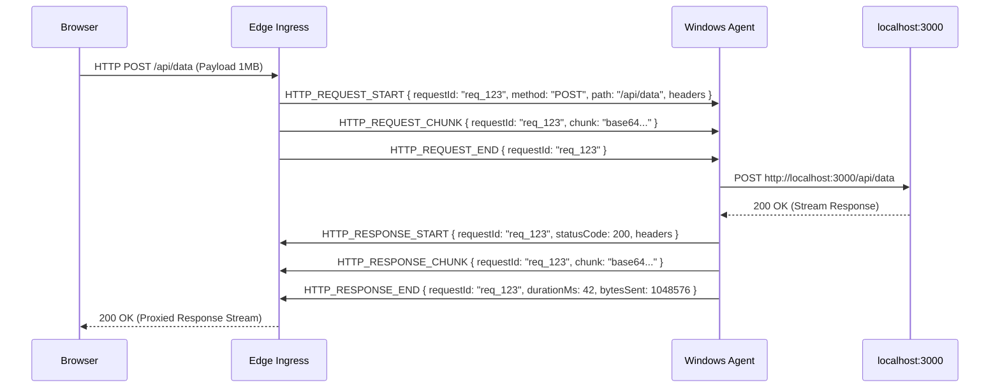

# 📡 Turnal Multiplexed Wire Protocol Specification

## Protocol Design Principles

1. **Multiplexing over Single Connection**:
   Multiple concurrent HTTP requests are streamed simultaneously over a single persistent outbound WebSocket/TLS connection without head-of-line blocking.
2. **Chunked Streaming**:
   Large payloads (file uploads, video streams, SSR responses) are split into base64-encoded binary chunks and streamed sequentially with matching `requestId` tags.
3. **Low Overhead**:
   Lightweight JSON / Binary framing with microsecond message processing.

---

## Message Framing Structure

Every wire message conforms to the following schema:

```typescript
interface ProtocolMessage {
  type: MessageType;
  timestamp: number;
  [key: string]: any;
}
```

---

## Message Types & Flow

### 1. Connection Handshake & Authentication



### 2. Request & Response Multiplexing



### 3. Health & Heartbeat

- Edge sends `HEARTBEAT_PING` every 15,000ms.
- Agent responds immediately with `HEARTBEAT_PONG`.
- If no heartbeat is received within 45,000ms, the session is terminated and cleaned up.
